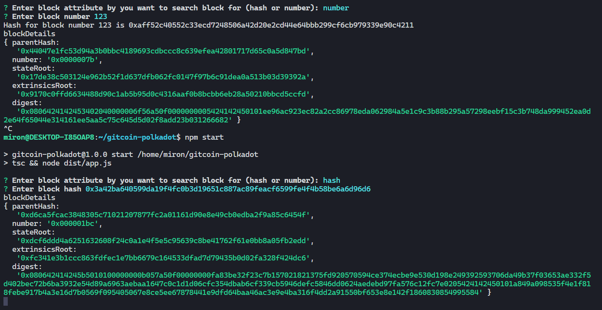

# gitcoin-polkadot
## Gitcoin Polkadot Hackathon

### [BEGINNER CHALLENGES] Back-End Javascript


## Using The Template

### Installation
```bash
# Clone the repository
git clone https://github.com/mirooon/gitcoin-polkadot/tree/5-back-end
cd ./gitcoin-polkadot
npm install
```
and run 
```
npm start
```
## Description

Used inquerier package to ask user in the terminal for the attribute (hash or number) as well as value of it.
To elicite block details application is using following queries to api:
```
await api.rpc.chain.getBlockHash();
await api.rpc.chain.getBlock();
```
