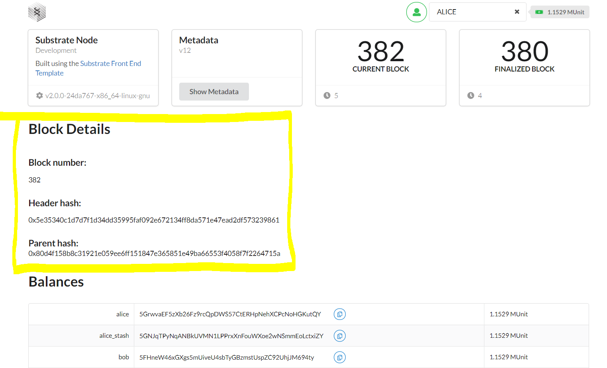

# gitcoin-polkadot
## Gitcoin Polkadot Hackathon

### LIVE VERSION: https://nostalgic-kilby-dea243.netlify.app/
### [BEGINNER CHALLENGES] Front-End Javascript


## Using The Template

### Installation
```bash
# Clone the repository
git clone https://github.com/mirooon/gitcoin-polkadot/tree/4-front-end
cd ./substrate-front-end-template
yarn install
```

## Added components
I have added BlockDetails component which is using api.rpc.chain.subscribeNewHeads function.